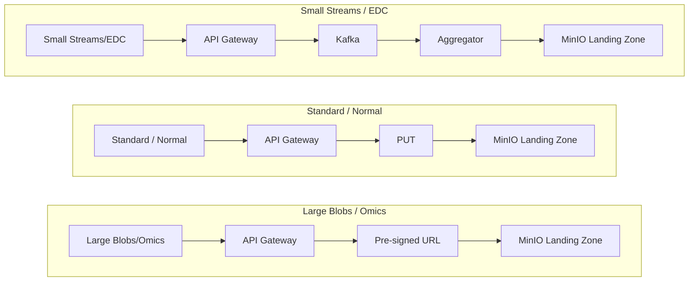

## Data ingestion & bronze layer

### Ingestion principles

1. Data immutability & idempotent processing: Raw data must be locked at the storage level (Write-Once-Read-Many - WORM). Furthermore, the ingestion pipelines processing this data must be strictly idempotent, utilizing sha-256 checksums to ensure that network retries or duplicate uploads never result in redundant writes or corrupt files.
2. Regulatory viability & federated custodianship: The platform enforces strict IAM access controls and GDPR lifecycle management (crypto-shredding). It operates under a federated governance model: the data lake functions as a secure centralized replica for downstream analytics, while the original data providers (e.g., CHL, IBBL) act as the primary legal custodians and maintain the original data locally.

### High level bronze layer architecture

The Bronze Layer is the platform’s secure ingestion gateway boundary. It strictly enforces a **"One Object, One Patient"** (i.e., each file contains data for one patient, but a patient can “own” many files) contract and must guarantee GDPR compliance without compromising data lake performance.

**Ingestion flow:**

1. **Secure ingestion gateway & identity:** External traffic hits a stateless FastAPI gateway. The gateway authenticates the tenant, replaces raw personally identifiable information (PII) with secure research pseudonyms (via Clinnova’s PSDS service), and determines the payload's physical routing.
2. **Payload routing:**
   *  **Small payloads** (e.g., clinical EDC): Routed through an Apache Kafka staging buffer to aggregate small files.
   * **Standard payloads** (a few MBs): Routed through a PUT method in the gateway.
   * **Large payloads**(e.g., omics): Bypasses the API compute layer using  S3 Pre-Signed URLs, streaming directly to a temporary MinIO landing zone.
3. **Demultiplexing & validation:** Apache Airflow detects (e.g., through webhooks) the uploads and triggers stateless containers to execute malware scans and structural validation. If a file is multiplexed (contains multiple patients), Airflow demultiplexes it into isolated, single-patient files, archiving the multiplex source file afterward.
4. **Immutable bronze vault:** The validated (demultiplexed) files are written to the final MinIO Bronze Vault. This bucket is locked in **Strict Compliance Mode (WORM)**, meaning the data can never be altered, overwritten, or physically deleted.
5. **GDPR crypto-shredding & lineage:** To comply with the "Right to Erasure" within a WORM bucket, [MinIO Enterprise server-side KMS](https://docs.min.io/aistor/installation/linux/server-side-encryption/aistor-keymanager/) encrypts every individual file with a unique key (DEK). The file's SHA-256 checksum (for idempotency) is logged in a permanent **PostgreSQL Audit Ledger**. If a patient revokes consent, the platform destroys their specific key, rendering their encrypted files irrecoverable.

{ width="100%" }

### Architectural Principles & Multi-Step Ingestion

This architecture assumes **upstream demultiplexing**; i.e., the platform operates on a strict **One Patient, One Object** contract. This ensures files can be securely purged via cryptographic erasure without introducing collateral data loss risks for other cohort participants. Raw data ingestion is isolated per tenant (i.e., one bucket per tenant):

* **Bronze landing layer**
  * Path: `s3://<tenant_id>/bronze_landing/<uuid>/<raw_filename.ext>`
  * Storage: Hot Storage / Unlocked
  * Incoming payloads land here.
* **Bronze layer**
  * Path: `s3://<tenant_id>/bronze/<uuid>/<raw_filename.ext>`
  * Storage: Hot-to-Warm Storage / [Compliance mode Locked](https://docs.min.io/aistor/administration/object-locking-and-immutability/#minio-object-locking-compliance), Strict WORM, never change or delete
  * Validated data is committed here as-is, preserving original formats.
* **Bronze archive layer**
  * Path: `s3://<tenant_id>/bronze_archive/<uuid>/<multiplex_raw_filename.ext>`
  * Storage: Hot-to-Warm Storage / [Compliance mode Locked](https://docs.min.io/aistor/administration/object-locking-and-immutability/#minio-object-locking-compliance), Strict WORM, never change or delete
  * This is where archived files go, e.g., multiplex files.

Note: The UUID is generated at ingestion time via the API gateway to ensure a collision-proof layout.

At this point we don’t enforce any prefix convention (e.g., data modality) since we assume a non-standardized naming convention for modalities. If that were not the case, we could add a prefix for each modality for organization purposes.

### Identity Layer, Entity Resolution & Pseudonymization

**Pseudonymization:** Any Personally Identifiable Information (PII) must be pseudonymized at ingestion time via the Clinnova’s PSDS service. If the local node (e.g., CHL) has already pseudonymized the data, this call is bypassed.

**Entity resolution (ER):** We leverage Clinnova’s Master Patient Index (**MPI**) component to provide the baseline identification layer across Electronic Data Captures (EDCs), unstructured data, and omics data, e.g., patient A from CHL is the same patient A in LIH.

For legacy datasets lacking a native IDs, an ER pipeline could be deployed to securely integrate records into an internal MPI. This could be done through deterministic or probabilistic methods (e.g., [Splink](https://www.gov.uk/algorithmic-transparency-records/moj-splink-master-record)) at the silver layer. *Note that detailed ER logic is considered out of scope for this architecture presentation.*

### Ingestion routing

To maximize data lake performance and prevent storage metadata bloat, the API gateway forks incoming traffic based on payload characteristics:

* **Very small payloads** (EDC): Should clinical observations from EDC systems yield small, fragmented payloads we may run into the “small file problem”. To mitigate this issue, these streams are published via the API Gateway to a staging buffer. A downstream stateless aggregation service aggregates these events, writing them to the landing layer as consolidated per-patient files.
* **Standard payloads ("Normal Data")**: Files ranging from a hundred KBs to a few megabytes (e.g., unstructured clinical PDFs or diagnostic reports) are routed via a HTTP PUT method directly through the gateway into the landing zone.
* **Massive payloads**: Routing massive binary payloads (e.g., 300GB FASTQ files or video data) through a REST API would result in frequent failures (OOM, disconnections, etc). To resolve this, the gateway uses a S3 Pre-Signed URL pattern. The client requests intent via the API, receives a time-bound URL, and streams the massive file directly to the MinIO landing zone via a multipart upload, bypassing the API compute layer entirely.

Proposed routing:

### Demultiplexing layer

While our target operating model enforces single-patient data ingestion, we must support **multiplexed** payloads containing data from multiple patients. If a multiplexed file is encrypted and committed directly to our immutable Bronze vault, we cannot execute a single patient’s erasure without collateral data loss for the rest of the file.

To resolve this, we route these payloads through a pre-bronze demultiplexing layer:

1. **Landing zone:** Data lands in the bronze_landing zone and is flagged via the API gateway as “is_multiplexed: True”.
2. **Demultiplexing:** This flag triggers an Airflow DAG that splits the payload into isolated, single-patient files.
3. **Standard routing:** Each demultiplexed file is then written into the standard bronze_landing bucket, where it undergoes normal validation and encryption before being locked in the Bronze tier.
4. **Multiplexed source archival:** Once the single-patient files are secured, the original multiplexed source file is archived.

### Bronze pre-processing & validation (landing to bronze)

The bronze pre-processing layer isolates ingestion volatility from the immutable bronze bucket. Within the bronze_landing bucket, Airflow orchestrates automated malware scanning and structural validation (e.g., catching headerless CSVs, unparseable FASTA formats) against each of the files in the landing zone.
Rather than relying on physical file movements for rejected data, this layer utilizes the PostgreSQL Audit Ledger as a relational state machine to logically quarantine failed files (e.g., “VALIDATION_FAILED”). A scheduled Airflow sensor periodically evaluates these parked files for re-validation based on specific TTL and retry configurations.
Other potential validation features include lifecycle management, warning systems, moving quarantined files to cold storage, etc.
Ultimately, only clean and structurally valid data is wrapped in unique Data Encryption Keys (DEKs) by the MinIO Enterprise KMS and moved to the immutable bronze bucket.

### Idempotency & audit ledger

To guarantee idempotency and prevent storing duplicate within the locked Bronze layer, every file is processed alongside a low-latency audit ledger (PostgreSQL). The checksum is generated automatically by MinIO and acts as a fingerprint for the file. If the same checksum is found via a database query, the duplicate is rejected.

### Audit Ledger Schema

* event_id (UUID, PK)
* event_type (VARCHAR), e.g., 'INGEST_LANDING', 'VALIDATED', 'REJECTED', 'CRYPTO_SHRED_COMPLETED'.
* event_timestamp (TIMESTAMP)
* patient_id(VARCHAR) - the secure research pseudonym generated by the PSDS.
* sha256_checksum (VARCHAR, Indexed)
* s3_uri (VARCHAR)
* payload_metadata (JSONB), a polymorphic block for payload attributes and other metrics

A payload_metadata could be received from the api gateway payload and supplemented via the pre-processing application layer, e.g.:

* validation_error (TEXT, Nullable)
* raw_file_name (String)
* file_extension (String)
* manual_release (Boolean)
* manual_release_owner (Nullable String)
* manual_release_timestamp (Nullable Timestamp)
* services version
* Other payload-specific metadata, e.g., project, cohort, partner, and data domain.

***Note: Since we preserve organizational information in the ledger, we can treat each data asset as logically independent, i.e., we only provide per-tenant separation for security reasons, every file within a tenant bucket is simply a pointer that can then be better organised in the gold layer.***
***It is also crucial that this audit ledger has some form of disaster recovery (replication, backups, etc) enabled since it is our central control point for orchestration. The audit ledger must be defined to be INSERT only via the GRANT  command.***

