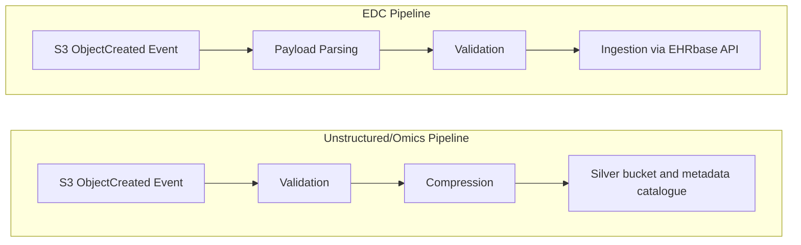

## Data processing & silver layer

### Processing principles

The Silver Layer serves as the internal processing layer of the platform, completely inaccessible to downstream consumers (similar to bronze). Whereas the bronze layer acts as a format-agnostic layer, the silver layer validates, compresses, and extracts and logs semantic context from the files.

To guarantee pipeline integrity, the Silver layer adheres to three strict principles:

* **Governance mode storage:** Because silver unstructured data must support recomputable pipelines and services updates, the silver bucket operates in “Governance Mode” with object versioning (rather than the strict immutable “Compliance Mode” locks of Bronze). This protects against accidental deletion while allowing authorized Airflow processes to overwrite silver data assets during pipeline replays.
* **Event-driven:** Legacy cron jobs or file-system polling are highly discouraged. Silver processing is asynchronous and event-driven, triggered exclusively by MinIO ObjectCreated Webhooks or Airflow Dataset Sensors (task dependent).
* **Deterministic processing:** All processing algorithms run in stateless, version-controlled containers (e.g., Docker containers or Kubernetes Pods). Software versions and container image SHAs are explicitly logged in the silver audit ledger, ensuring that re-running a pipeline on a Bronze file yields the exact same Silver output.

***Note: Similar to the bronze ingestion layer, the silver processing layer will also insert events into a silver audit ledger.***

### High level silver layer architecture

* **Storage:** Configured in Governance Mode (versioned, recomputable) to allow automated Airflow pipeline replays and upgrades while protecting against accidental deletion.
* **Structured pipeline (EDC):** Parses raw payloads and ingests data via API into EHRbase (openEHR CDR), preserving granular clinical data
* **Unstructured pipeline:** Runs automated integrity checks, verifies file patient IDs against the Master Patient Index (MPI), and this connection to an **Identify bridge table**. Files are also lossless compressed.
* **Metadata catalogue:** Extracted features are indexed in a dedicated metadata catalogue to offload heavy discovery queries from operational systems.
* **Quarantine & Remediation:** Failed or unlinked files are tagged in the ledger, triggering a retry loop with a maximum TTL.

### Silver processing forking

At a high level, Silver orchestration is divided into two parallel pipelines based on the incoming data modality:

#### EDC pipeline

For structured clinical data (EDC), the workflow relies on physical decoupling: raw payloads land in the locked Bronze object store, triggering Airflow DAGs to ingest, parse, transform, and validate the structured data and send it to the EHRbase API (the openEHR Clinical Data Repository). EHRbase functions as our clinical data relational silver database.

The aim of this process is to convert raw data into OpenEHR archetypes so that the underlying storage enables long term persistence, supports a wide range of applications, is “easy” to maintain, and holds semantic meaning for downstream serving. OpenEHR is the natural fit for the initial ingestion of clinical data, but we could complement it with FHIR (external tools integration) or OMOP (analytics). Due to the nature of the institute, the most logical combination would be OpenEHR for initial ingestion and data model standardisation (Silver layer), and OMOP for research and analytics (Gold layer).
**In other words, OpenEHR is used for persisting data with complete granularity, whereas OMOP introduces a less granular canonical data model(s) that can be more easily served to downstream analytics or processing.**

#### Advantages of the openEHR two-level approach

* **Long term persistence and zero schema migrations:** The Reference Model provides a stable, universal data structure that never changes based on local clinical workflows.
* **Granular context preservation**
* **Clinical context and engineering separation:** Software engineers manage the core platform infrastructure (reference model), while clinical experts define the semantics. This clearly divides technical software coding from medical knowledge management (archetypes and templates).
* **Automated validation:** data payloads are automatically validated against the constraints embedded in the openEHR templates at the API level.
* **Query portability (AQL):** Archetype Query Language (**AQL**) queries the clinical concept rather than physical database columns.

##### Why not OMOP only?

OMOP is optimized for fast analytical queries, meaning it is inherently lossy already during data modelling.

* **Data flattening:** Forcing complex clinical forms directly into flat OMOP tables strips out critical context. Granular context is exactly the kind of data that modern ML models require for pattern identification.
* **Rigid ingestion:** OMOP schemas are fixed around standard vocabularies. If a new study introduces non-standard metrics, these cannot be easily and quickly mapped.

##### Why not openEHR only?

While openEHR is the optimal solution for granular storage and long-term persistence, it causes delivery bottlenecks at the serving layer.

* **Analytical overhead:** openEHR structures are deeply nested and hierarchical. Running heavy aggregations or survival analyses natively via AQL introduces computational overhead and requires specialised OpenEHR knowledge.
* **Data format mismatch:** Data scientists and machine learning tools expect flat tabular dataframes, not complex nested JSON compositions, leading to downstream adhoc data flattening solutions.

##### The dual-model synergy

By deploying both, we decouple **data persistent** from **data analytics**. openEHR (e.g., EHRbase) handles complete granularity, long-term persistence and strict validation in the silver layer. Downstream ETL flattens and maps the openEHR data into OMOP CDM tables in the Gold layer, serving data without losing the clinical source of truth.

An additional operational benefit of the dual-layer approach is that the OMOP serving layer can be built **incrementally and use-case by each research group**. Instead of executing massive, computationally expensive ETL pipelines that constantly re-analyze raw EDC data, data engineers can query the clean, standardized openEHR archetypes already residing in the Silver layer. While this requires more infrastructure, this makes the OMOP ETL pipelines rely on heavily vetted data, faster to query and easier to maintain. [OMOPHub provides a good example of this sort of pipeline design](https://docs.omophub.com/guides/integration/ehrbase-openehr#9-openehr-%E2%86%92-omop-pipeline).

##### openEHR clinical data repository (CDR) & tooling

###### Core persistence & validation (EHRbase)

The platform leverages EHRbase, an open-source, production-ready Clinical Data Repository (CDR) to persist structured EDC data. EHRbase provides the foundational out-of-the-box infrastructure required to handle high-throughput API ingestion, long-term version-controlled persistence, and semantic validation against the openEHR Reference Model.

###### Payload transformation and validation (Pydantic)

For payload transformation we will use Pydantic for two reasons: transformation and validation. While EHRbase already enforces strict schema constraints at ingestion, it is likely that some EDC records may contain errors or missing data. Therefore, before payloads are sent to the EHRbase API, a process uses Pydantic to:

* Transform raw data into the EHRbase API payload format (i.e., the data contract)
* If the data is corrupted or key parameters are missing, Pydantic either fixes missing data issues or raises an exception, then routing the record accordingly.

###### Clinical data modeling & governance (CKM & Archetype Designer)

The engineering overhead shifts from database management to precise clinical data modeling. The platform minimizes custom design by drawing from a mature, international ecosystem:

* **The Clinical Knowledge Manager (CKM)**: Data modelers prioritize the reuse of pre-built, globally standardized Archetypes.
* **Low-Code Archetype Designer**: When novel clinical trial metrics or unique research parameters are introduced, clinical data managers utilize visual, low-code modeling tools to design and compile custom Templates .

#### Unstructured/Omics data pipeline

Because omics, imaging, and multimedia data are heavily bound to underlying research methodologies, monolithic standardization is not feasible. The bronze-to-silver unstructured data DAG focuses on:

* Data validation
* Metadata extraction and semantics standardization for enhanced searchability and cataloguing
* Lossless compression

Data storage of silver data follows a similar folder structure to the bronze layer:

* **Silver layer**
  * Path: `s3://<tenant_id>/silver/<uuid>/<raw_filename.ext>`
  * Storage: Hot-to-Warm Storage / [Governance mode Locked](https://docs.min.io/aistor/administration/object-locking-and-immutability/#minio-object-locking-compliance), versioned, recomputable, replayable pipelines
  * Processed unstructured assets are committed here after validation and compression; lifecycle policies limit retained versions, with older versions moved to cold archive storage.

##### Structural validation & identity linkage

Before any processing occurs, files are evaluated against structural heuristics and identity checks. Below you can find a non-exhaustive list of putative validation steps per data type:

###### Genomics data

* FASTQ Integrity: Run gzip -t <file.fastq.gz> to check file integrity
* BAM/CRAM sanity check: samtools quickcheck.

###### Multimedia & Bio-imaging data

For DICOM assets, the validation layer focuses strictly on structural metadata and heuristics rather than deep image analysis. The validation process uses standard imaging libraries to verify mandatory header tags:

* Format Compliance: Checking standard identifiers to verify the file is a structurally sound medical image before downstream processing.

###### Identity linkage among modalities

Across all data modalities, the processing worker must extract the internal patient identifier (e.g., the DICOM PatientID or the FASTQ metadata tag) and verify that the pseudonymized patient ID explicitly exists within the platform's Master Patient Index (MPI) or openEHR registry. If the patient record cannot be resolved, the asset is rejected and must be retried later (up toa limit).

###### Validation failures & logical quarantine

Any file that fails validation does not physically move. Instead, an event is appended to the silver audit ledger, mutating its state to “VALIDATION_FAILED” or “ORPHAN_PATIENT_ID”, logically quarantining it from downstream Silver pipelines.
The same file can be revalidated at a later stage, e.g., for identity linking issues, we could set a recurring 1 day retry, and a TTL of 90 days since we assume that there’s a temporal decoupling of the patient sample data and the OpenEHR/MPI system.

##### Data processing & metadata

Because unstructured files are not self-describing, workers extract baseline payload metadata and augment it with features derived directly from the files:
Below you can find a non-exhaustive list of putative metadata features per data type; note that for obvious reasons this validation step and feature extraction would need to be built incrementally through the use of institutional knowledge (use-cases, important features, etc).

###### Genomics data (FASTQ / BAM / VCF)

* Technical Attributes: Reference genome build used (e.g., HG38), alignment software version, sequencing instrument model (e.g., Illumina NovaSeq 6000), flowcell ID.
* Quality Metrics: Average coverage depth (e.g., 30x), percentage of bases exceeding Q30, total read count, and total number of variant calls (for VCFs).

###### Multimedia & Bio-Imaging Data

* DICOM Headers: Modality (CT, MR, PET), body part examined (CHEST, BRAIN), slice thickness
* Video/Audio Metrics: Resolution (e.g., 1080p), framerate (60fps), total duration

###### Documents (PDF)

* Metadata: Page count, original authoring application, creation date, and language tags.

##### Silver metadata cataloguing, lineage & discovery

All extracted metadata attributes and data lineage are published to a dedicated Silver Metadata Catalogue (e.g., publishing it to [OpenMetadata](https://open-metadata.org/)).

The augmentation of this metadata, such as generating derived semantic AI embeddings to enable natural-language discovery is explicitly deferred to the Gold Medallion layer.

##### Data compression

To optimize I/O throughput and storage costs without sacrificing biological fidelity, the platform prioritizes interoperable, widely supported lossless formats over pure compression ratios:

Below you can find a non-exhaustive list of industry standards for compression per data type:

###### Genomics Data

* FASTQ (Raw Reads): .fastq.gz compressed via bgzip (block gzip).
* BAM (Aligned Reads): Binary Alignment Map compressed via bgzip.

###### Multimedia & Bio-Imaging Data

* Microscopy & Spatial Omics: OME-TIFF compressed with Deflate (Zip) or LZW.
* Medical Imaging (CT, MRI, PET): DICOM containing JPEG 2000 Lossless or JPEG-LS payloads.

###### Clinical & Operational Documents

* Electronic Records & Supplemental Sheets: PDF/A

###### Tabular Data

* Standard tabular data (Apache Parquet): Validated, highly structured tabular datasets are serialized into Apache Parquet format. This enforces columnar storage layouts, and is supported by the majority of Data engineering tools.

##### Identity bridge table

After processing and storing these files, we also store the link between each file and the respective patient that this data was generated from:

* patient_id
* s3_uri
* modality
* file_type
* sha_256_checksum

*This will be important later on for the knowledge graph and GDRP compliance.*

