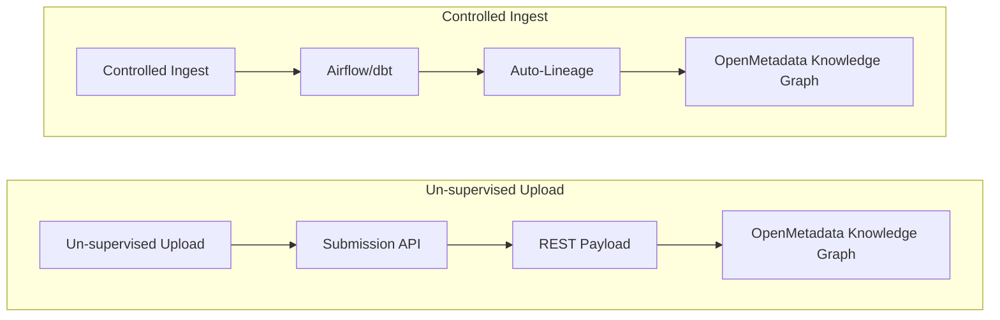

## Data serving & gold layer

The Gold Layer is dedicated to **data democratization, semantic discovery,** and **high-throughput computational workflows**. It shifts the architecture from storage-driven into a research serving layer. The gold layer has a several high level objectives:

* Convert OpenEHR data into OMOP for analytics-driven serving
* Serve omics and unstructured data
* Integrate researchers data in a coherent manner so that it’s available to other downstream users/AI workflows
* Generate deeper semantics and a better catalogue so that we have better discoverability and a more informative knowledge base
* Export additional links between derived data assets (across all different modalities)

***Note that we also re-use the same Audit ledger mechanism in the gold layer for automated processes (gold audit ledger) which is essentially what backs the retry mechanism.***

### Clinical data analytics - converting EDC to OMOP

#### OpenEHR  auditing (Great Expectations)

An auditing job is scheduled to audit a sub-set of the OpenEHR data according to  [Great Expectations](https://greatexpectations.io/) (GX) expectations. These audits would be served into the gold layer and used internally for tracking ECD integration.

#### OMOP Common Data Model (CDM) & Tooling

While openEHR handles our granular ingestion, the OMOP CDM requires a distinct set of tools optimized for analytics and vocabulary standardization. The OMOP architecture would rely on 3 core pillars:

* **Database tier (OMOP CDM & PostgreSQL):** The OMOP CDM will reside in a dedicated PostgreSQL database within the Gold layer.
* **Transformation Engine (dbt):** To populate the OMOP tables we will use [**dbt**](https://www.getdbt.com/product/what-is-dbt) **(Data Build Tool)**.
* **Vocabulary repository & Analytics Suite (OHDSI Athena & ATLAS):**  We will use the [**Athena**](https://github.com/OHDSI/Athena) repository to download and manage standard medical ontologies. To serve the data to our researchers, we will deploy [**ATLAS**](https://github.com/OHDSI/atlas), an open-source web-based analytics platform that sits on top of the OMOP database. ATLAS allows downstream users to build complex cohorts, define patient phenotypes, and run population-level statistical analyses without writing raw SQL.

***Note: While EHRBase is OLTP centric, OMOP should be optimized for OLAP, which will require planning the internal tables to optimize for analytical processes (indexing, partitioning, etc), potentially even migrating to an OLAP-centric database engine.***

#### OpenEHR to OMOP pipeline

1. **Deploy the standard OMOP schema:** Deploy the official OHDSI OMOP CDM tables (e.g., PERSON, MEASUREMENT) into the gold database.
2. **Define the AQL Command:** Data modellers define a "wide" AQL template to extract all required clinical variables in a flat format.
3. **Define the dbt SQL mapping**: Data engineers write the version-controlled dbt models to map the flat AQL output to the standardized OMOP tables (e.g., using OMOPHub for term resolution). Fields that must be masked must be defined here so that dbt can mask them during transformation.
4. **Detection of new compositions:** A job checks (or we stream them) for any new OpenEHR compositions since the last time it ran, and queries the openEHR REST API using the AQL command for only that batch of composition IDs.
5. **Staging dump:** the flattened API data response is streamed/dumped to the staging table (e.g., buffer__openehr__my_omop_cdm).
6. **dbt Transformation:** dbt reads only the newly inserted rows in the buffer, transforms them using SQL (also masks personal health information), and upserts them into a staging table of processed OMOP tables (e.g., stg__omop__my_omop_cdm).
7. **CDM validation:** We run data validation on the staging OMOP CDM via [DQD](https://ohdsi.github.io/DataQualityDashboard/)
8. **dbt insertion (publish):** If the data validation passes, dbt promotes the data from the staging OMOP CDM into the  final serving OMOP tables. If it fails, we log the failure in the audit ledger with composition IDs for review. The staging OMOP CDM is reset in the next run.

***Note: For organizational purposes, we would need to organise the Postgres DB into e.g., different schemas per research group. Naming conventions would need to be agreed upon and would depend on the underlying structure of research groups and expected modelling approaches. This schema-per-tenant approach ensures strict logical isolation, simplifies security implementation, and prevents cross-contamination of specialized modeling approaches.***
***We will follow DBT’s naming conventions, please refer to this [link](https://docs.getdbt.com/best-practices/how-we-style/1-how-we-style-our-dbt-models?version=2.0&name=Fusion).***

***Note: To handle semantic mapping without introducing external API latency into our data pipeline (step 3), we will use a pre-compiled mapping. For example, we use OMOPHub to resolve terms present in the relevant data model and generate standard vocabulary crosswalks. These crosswalks are loaded into our PostgreSQL database as static reference tables (e.g., via [dbt sources](https://docs.getdbt.com/docs/build/sources?version=2.0&name=Fusion)). We would require a Human-in-the-loop approach to validate these mappings.***

#### OMOP data validation & auditing

For data validation and auditing we can run open-source software on our OMOP data, e.g., the Data Quality Dashboard ([DQD](https://ohdsi.github.io/DataQualityDashboard/)).

#### FHIR data serving

Similar to OMOP, we could also provide a FHIR API by leveraging [OpenFHIR](https://open-fhir.com/) to serve clinical data. FHIR would be generated from the EHRBase database and serve as an interoperability/API layer to expose clinical data.

### Gold layer organization strategy

#### Naming conventions: snake_case

In the bronze and silver layer we follow the snake_case convention for name formatting any internally generated files. Since we don’t want to edit the raw file names, we can simply lower case them. For files ingested or created within the gold layer, we will enforce a snake_case naming convention.

#### The Tokenization Rule: _ vs __

##### The Single Underscore (_): Word Spacer

A single underscore handles basic semantic spacing between words within a single concept block, e.g., my_descriptive_term, tenant_a, source_registry, oncology_project

##### The Double Underscore (__) or slash (/): Namespace Boundary

The double underscore serves to abstract hierarchical boundaries, e.g., omop__core__tenant_a__oncology, which maps to {“omop”: {“tenant_a”: {“oncology”:  …} ...} ...}. For S3 storage we use a slash to define the namespace, e.g., s3://omop/tenant_a/oncology

This ensures that the format is both human and machine readable (to infer organization).

***Note: This tokenization framework is used both within the relational (or non relational) databases as well as the S3 object storage.***

#### Relational schemas and tables

##### Global OpenEHR->OMOP vocabulary dictionary

* omop__ehr_to_omop_vocabulary: The shared repository of standard OHDSI concepts (e.g., SNOMED, LOINC). Every OpenEHR->OMOP translation translation requires it for ontology translation. Automatically populated by OMOPHub and validated via a human-in-the-loop approach.

##### Per-tenant ingestion buffer

* omop__stg__tenant_a:  stores new OpenEHR compositions for each tenant. A metadata column in this table flags exactly where the data came from (e.g., source_registry = 'oncology') so that it can be mapped to a downstream OMOP CDM (or potentially multiple OMOP CDMs)

##### Per-tenant and per-source isolated OMOP CDMs

* omop__cdm__tenant_a__source_registry_a
* omop__cdm__tenant_a__oncology

***Note: Each OMOP schema will naturally have the necessary OMOP CDM tables.***

##### Research groups relational data:

* rg__my_group__oncology_project_2026: When the oncology research group works on a project, their sandbox schema is granted read-only access strictly to chl_omop__core_oncology and omop__vocabulary. We could provision this for federated research as well.

#### S3 object storage

Similar to our ingestion layer, the serving of files downstream uses a forking delivery system, i.e., the Serving API gateway.
Unlike the physical storage abstraction in the bronze and silver layers, the gold layer uses a more flexible custom storage topology. We continue to enforce the same tokenization rules (_ for word spacing, / for namespace boundaries) to organize files within the gold buckets, but we remove strict hierarchical depth limits, allowing researchers to nest project folders as needed.
Because the Gold Layer aggregates data across multiple tenants for research and analytics, we physically separate buckets by research group boundaries:

* **Gold common bucket**
  * Path: `s3://gold_common/<namespace_path>/<filename.ext>`
  * Storage: Hot Storage / Fine-grained IAM
  * Institute-wide shared assets; generally treated as "public" within the institute.
* **Gold research group bucket**
  * Path: `s3://gold_<research_group>/<cohort>/<modality>/...`
  * Storage: Hot Storage / Fine-grained IAM (research group coordinator)
  * Group-specific assets; the group head coordinates access control (e.g., `s3://gold_dep_cancer_res/leukemia/genomics`, `s3://gold_dep_infect_immuno/gut_microrbiome/transcriptomics`).

***Note: While we isolate data per research group at the bucket level, we also enforce fine-grained IAM (Identity and Access Management) policies within each bucket. This allows us to securely restrict access down to specific folders or prefixes, a standard feature in [enterprise object storage solutions](https://docs.min.io/aistor/administration/iam/access/).***

To foster collaboration, any derived data asset produced by a researcher can be uploaded back into the ecosystem using a dedicated **Submission API**. This ensures the data is properly logged, enriched with lineage, and securely exposed to other authorized users within the same research group, or across the institute, depending strictly on defined access policies.

#### Serving API

Small files can be requested through an **API serving gateway**, whereas large files (e.g., omics data) can be served through secure time-bound pre-signed URLs. We could similarly expand this to not only handle files, but also pre-formatted data for model training through an off-the-shelf feature store (further investigation on specific tools would be needed).
For model registry and serving we could use MLFlow (industry standard) since it uses a S3-driven artifact registration and serving.

#### Submission API

This gateway enforces a strict compliance check before data is accepted into the system. Rather than creating friction by requiring the uploader (e.g., a researcher) to manually submit granular provenance and lineage records, the API is designed to do the heavy lifting:

* **Automated data extraction:** The API automatically extracts physical file provenance upon upload. It infers schema definitions, calculates file sizes, and cross-references existing Gold/Silver layer hashes to programmatically infer technical lineage. (potentially leveraging SLURM jobs lineage)
* **Minimal manual input:** The uploader is only prompted to provide essential semantic business context that a machine cannot infer (e.g., Project ID, clinical study name, or cohort description, patient ID links).
* **File upload, ledger append & catalogue sync**: If all validation steps pass, the API routes the file to the appropriate gold S3 bucket (e.g., s3://gold_my_group/), appends a success event to the gold audit ledger, and dynamically sends a payload to OpenMetadata.

#### Knowledge base, semantics data lineage, and AI serving

To ensure data traceability, the platform utilizes a hybrid lineage tracking strategy. For automated processing steps, such as the Bronze-to-Silver pipeline, lineage is automatically exported via the Airflow DAG.
For un-supervised processing (i.e., external research steps not controlled directly by the data platform), the architecture exposes a dedicated **Submission API**.
Row level entity linking must be provided through the Submission API or automatically inferred from silver to gold DAGs.

By augmenting these technical tracks with rich business and clinical semantics, such as data profile schemas, and analysis summaries, the platform transforms raw flat files into an integrated knowledge base. This data asset is explicitly designed to power downstream automation, making it natively optimized for AI-driven, autonomous (agentic) workflows.

##### Row level entity linking

The platform resolves the full clinical chain — patient → visit → sample → biomaterial → omics result → clinical document through a combination of interlocking layers rather than a single registry.

1. **Identity Bridge Table**: The first link is established at ingestion time. Every unstructured, omics, or bioimaging file processed through the Silver pipeline is written to the identity bridge table with its patient_id, s3_uri, modality, and file_type. This means that from the moment a FASTQ file or a DICOM scan lands in Silver, it is already bound to a pseudonymized patient identity resolved via the MPI. Critically, this binding does not require the file to pass through EHRbase. Derived data within the gold layer passes is forced to pass through the Submission API,  forcing it to also be equally anchored via the patient_id in the identity bridge table and therefore linked across all modalities.
2. **OpenEHR as the clinical context anchor:** for EDC data EHRbase preserves the full clinical hierarchy for structured EDC data. A visit is an EHR Composition, and a sample collection or biomaterial event is modeled as an Action or Observation archetype within that composition, carrying a versioned composition_id. This is the authoritative record of what happened clinically, the visit, the sample draw, the lab request. This data can then be easily joined with the Identity bridge.
3. **OpenMetadata as the cross-layer lineage graph:** At the Gold layer, OpenMetadata connects the technical and clinical lineage together into a traversable graph. Every automated pipeline (Airflow DAG, dbt model) exports its lineage automatically. Every researcher-submitted derived file is registered via the Submission API with explicit patient_id links and provenance metadata. A data steward or AI agent can therefore traverse the knowledge graph to answer questions like "which omics files were derived from samples collected at visit V for patient P, and which clinical documents reference the same visit?" without issuing raw database queries, purely through the [MCP interface](https://docs.open-metadata.org/v1.12.x/how-to-guides/mcp/reference#openmetadata-mcp-tools-reference).

This cross-layer lineage is also an important feature of this architecture for GDPR compliance. When a patient withdraws consent, the Security & Compliance Officer triggers crypto-shredding on the Bronze DEK. Because the identity bridge table links every downstream Silver and Gold asset back to the same patient_id (regardless of modality) the cascade deletion job can enumerate every affected file (e.g., omics files in Silver, derived datasets in Gold, OMOP records, FHIR resources, and OpenMetadata catalogue entries), and purge or suppress them.

