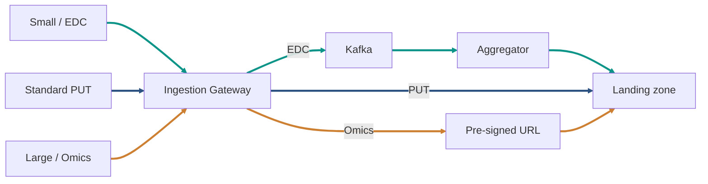

# Landing → Bronze

---
layout: default
class: diagram-slide optional-slide
---

# Landing → Bronze

---
class: compact-slide
---

# Payload routing

---
class: compact-slide optional-slide
---

## Ingestion gateway

- Authenticated stateless ingestion gateway
- Pseudonymization at the boundary for all inbound PII (calls Clinnova's **PSDS**).
- Routes payload by size and modality

## Patient ID & identity linkage 

- Master Patient Index (MPI) links all modalities: EDC, unstructured, and omics to one patient identity
- Data is re-verified during downstream silver processing from file headers (e.g., FASTQ tags)

## Demultiplexing

Multiplexed files **must not** enter WORM bronze intact.

1. Land in `bronze_landing` with `is_multiplexed: true`
2. Demultiplexer splits into single-patient files
3. Each file goes to landing layer → normal validation → bronze vault
4. Original multiplex → `bronze_archive`

---
class: compact-slide optional-slide
---

# Pre-validation (landing)

- Malware scan + file structure checks (generic and file-type specifics)
- Failures → **logical quarantine** in audit ledger (`VALIDATION_FAILED`)
- Airflow sensor retries with TTL - no physical move required
- Clean files → per-file **DEK** → immutable **bronze** bucket (encrypted and WORM)

**Once files are established as valid they move to the bronze bucket**

---
class: compact-slide optional-slide
---

# Structural validation & compression

*Examples by modality — built incrementally per use case*

**Structural validation (landing / bronze)**
- **Genomics:** `gzip -t` on `.fastq.gz`; `samtools quickcheck` on BAM/CRAM
- **Imaging:** DICOM mandatory tags (modality, SOP Class UID) — format compliance, not deep image QA
- **Documents / tabular:** headerless CSV, unparseable FASTA/FASTQ magic bytes
- **All modalities:** malware scan; `patient_id` cross-check vs MPI where extractable from headers

