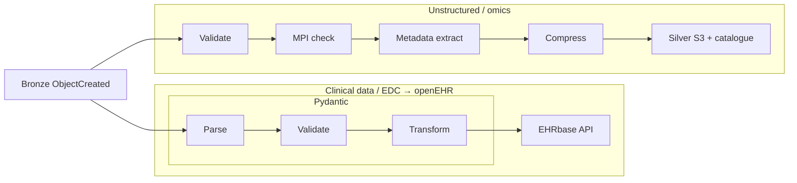

# Bronze → Silver

---
layout: default
class: diagram-slide optional-slide
---

# Bronze → Silver

---
class: compact-slide
---

# Bronze vs silver file locking and immutability

| Bronze | Silver |
|--------|--------|
| Compliance mode (WORM) | Governance mode (versioned) |
| Immutable source of truth | Replayable; authorized overwrite on pipeline replay |
| SSE-KMS (per-object DEK) | SSE-KMS (per-object DEK) |
| Erasure: destroy DEK (WORM) | Erasure: delete object/versions |
| **Bronze** audit ledger (ingest, payload metadata) | **Silver** audit ledger (processing, pipeline fingerprint) |

*Silver pipelines fingerprint is preserved to allow for deterministic replays*

---
class: compact-slide

---

# Silver pipelines (fork by modality)

*OpenEHR archetypes and templates to be defined by data modeller and mapped to data collection system*

Per-modality feature extraction (genomics, imaging, documents) → **OpenMetadata** catalogue

- Extracts superficial semantics: Reference genome, coverage, Q30%, modality, slice thickness, page count, etc
- Deferred deeper semantics (e.g., AI embeddings for documents deferred to **Gold**)
