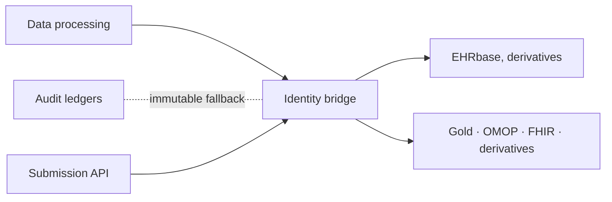

# Identity bridge table

`patient_id` · `s3_uri` · `modality` · `file_type` · `sha_256_checksum`

---
class: compact-slide
---

# Row-level entity linking — mechanism

---
class: compact-slide
---

# GDPR erasure & cascade

- **Bronze:** destroy per-file **DEK** (SSE-KMS) - WORM object stays, ciphertext unreadable; ledger `CRYPTO_SHRED_COMPLETED`
- **Cascade** (via **identity bridge** + `patient_id`): Silver S3 · Gold OMOP / FHIR / derived · OpenMetadata catalogue
- **Derived uploads** must use **Submission API** with `patient_id` - otherwise cascade may miss researcher assets

---
class: compact-slide
---

# Discovery, analytics & observability

- **ATLAS** (OMOP) - cohorts, phenotypes, population-level analytics (ABAC-scoped schemas)
- **OpenMetadata** (read-only governance graph — not operational identity):
  - **Catalogue & search** - Silver/Gold assets, schemas, modality metadata (offloads heavy discovery from internal DBs)
  - **Lineage** - automated from Airflow/dbt; researcher uploads via **Submission API**
  - **Quality & observability** - GX + pipeline integration, alerts/dashboards; DQD OMOP metrics
  - **Governance** - business glossary, tags; discovery marketplace (RBAC/ABAC-scoped)s
- **Airflow** - DAGs health
- **MCP** - stewards & AI agents query the graph (e.g. *omics from visit V for patient P?*) without raw SQL
- **GX + DQD** hostingg (clinical data quality)
- Ops metrics with Grafana/Superset
