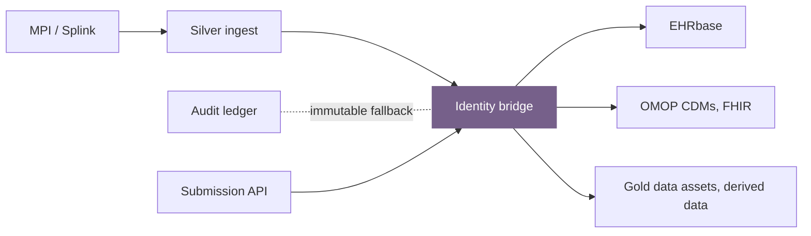

# Identity & compliance

---
class: compact-slide diagram-slide
---

# Identity bridge table

`patient_id` · `s3_uri` · `modality` · `file_type` · `sha_256_checksum`

**Operational source of truth** at Silver ingest — Submission API must anchor derived assets here.

---
class: compact-slide optional-slide
---

# Row-level entity linking — mechanism

- **Identity bridge** — operational source of truth (`patient_id` + `s3_uri` at Silver)
- **Audit ledger** — immutable fallback for MPI drift / merges
- Others are derivatives

---
class: compact-slide diagram-slide optional-slide
---

# GDPR erasure & cascade

- **Bronze:** destroy per-file **DEK** (SSE-KMS) - WORM object is preserved, ciphertext unreadable; ledger `CRYPTO_SHRED_COMPLETED`
- **Cascade** (via **identity bridge** + `patient_id`): Silver S3, Gold OMOP / FHIR / derived, OpenMetadata catalogue
- **Derived uploads** must use **Submission API** with `patient_id`, otherwise cascade may miss derived data assets

